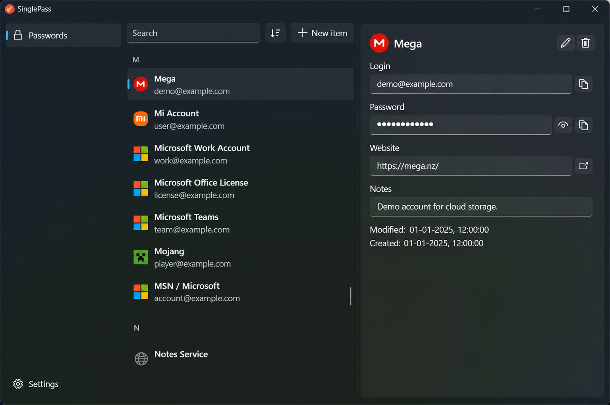
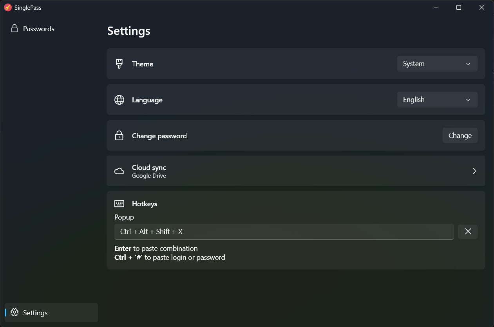

# SinglePass.WPF

SinglePass is a Windows password manager with a local encrypted vault, a quick-access popup for filling credentials in other applications, and optional cloud synchronization.

## Features

- Create, edit, delete, search and sort credentials. Each entry can contain a name, login, password, website, notes and additional fields.
- Organize credentials into custom groups. Select a group in the sidebar to filter the list, or drag one or more selected entries onto a group to move them.
- Copy credentials to the clipboard, show or hide passwords, and open saved websites in a browser.
- Generate and copy time-based one-time passwords (TOTP) from a saved entry.
- Search by name, login, website or notes, including transliterated text.
- Open a quick-access popup with a configurable global hotkey. The popup can suggest entries based on the current browser address and paste a login and password or individual fields.
- Synchronize or upload credentials to Google Drive or Yandex Disk after signing in.
- Change the master password, choose a theme and select English, Russian or the system language.
- Automatically lock the vault when the Windows session locks or after five minutes without keyboard or mouse input. Enter the master password to reopen it.
- Access the application from the Windows notification area.

## Getting started

Download `SinglePass.WPF.zip` from [Releases](https://github.com/Erapchu/SinglePass.WPF/releases), extract it and run the application. The archive contains a self-contained Windows x64 build.

On first launch, enter a master password of at least eight characters. Use that password to unlock the vault. Keep a secure backup of the vault file and its master password so you can decrypt the backup.

### Two-factor authentication codes

1. In the account's security settings, start setting up an authenticator app.
2. Create or edit the entry in SinglePass. Paste the Base32 setup key or an `otpauth://totp/` link into **2FA setup key or otpauth link**. For a QR code, copy a screenshot of it to the clipboard and select **Paste QR code**.
3. Save the entry. **One-Time Password** in the entry details shows the current code and its countdown. Use **Copy verification code** to copy it and finish setup on the website.

### Quick-access popup

1. Add a credential and fill in its website address.
2. Set a popup hotkey in **Settings**.
3. Open the website in a Chromium-based browser, focus the login field and press the configured hotkey.
4. Select an entry in the popup to paste the credentials. You can also search or paste individual fields.

The popup uses the clipboard and simulates keyboard input. Filling both fields assumes that pressing Tab moves focus from the login field to the password field; behavior depends on the target application and page.

### Cloud synchronization

Open **Settings → Cloud Sync** and sign in to Google Drive or Yandex Disk. **Upload** sends the encrypted local vault to the selected provider. **Sync** downloads the provider's vault and merges it into the local vault, including groups and group assignments.

#### Configure Yandex Disk

1. Register a [Yandex OAuth application](https://oauth.yandex.ru/client/new/id/) with the redirect URI `http://localhost:17682/`. Grant application folder access (`cloud_api:disk.app_folder`), profile access (`login:info`) and avatar access (`login:avatar`).
2. Set the `Settings__YandexDiskConfig__ClientId` and `Settings__YandexDiskConfig__ClientSecret` environment variables for the SinglePass process, then restart SinglePass. To use another loopback port, register its exact URI and set `Settings__YandexDiskConfig__RedirectUri` to match.
3. Sign in under **Settings → Cloud Sync → Yandex Disk**. Use the same OAuth application on each computer to access the same app folder.

## Data and configuration

Application data is stored under `%LOCALAPPDATA%\SinglePass`:

- `singlePass.dat` — encrypted vault containing credentials, groups and saved TOTP setup data.
- `commonSettings.json` — application settings.
- `googleDrive.token` — Google Drive authorization data protected by Windows for the current user. SinglePass migrates the former `googleDrive.json` and removes it after saving the protected token.
- `yandexDisk.token` — Yandex Disk authorization data protected by Windows for the current user.
- `Cache` — cached data; logs are stored in `Logs`.

The vault uses AES-256-GCM encryption with a key derived from the master password using Argon2id. SinglePass upgrades older local vaults after you unlock them successfully. If an upgrade creates a `singlePass.dat.before-groups.bak` file, keep it secure alongside any other vault backups.

## Build from source

The project targets .NET 10 and Windows x64. Building requires Windows, the .NET 10 SDK and Visual Studio/MSBuild with the .NET desktop development workload; the project uses a Windows UI Automation COM reference.

From a Visual Studio Developer PowerShell at the repository root:

```powershell
msbuild .\SinglePass.WPF.sln /t:Restore /p:Configuration=Release
msbuild .\SinglePass.WPF.sln /t:Build /p:Configuration=Release
```

To publish a self-contained Windows x64 build, as in the release workflow:

```powershell
msbuild .\SinglePass.WPF\SinglePass.WPF.csproj /t:Publish /p:Configuration=Release /p:RuntimeIdentifier=win-x64 /p:SelfContained=true /p:PublishReadyToRun=true /p:PublishSingleFile=true
```

The output is in `SinglePass.WPF\bin\Release\win-x64\publish`.

## Screenshots





## License

This project is licensed under the [GNU General Public License v3.0](LICENSE).
