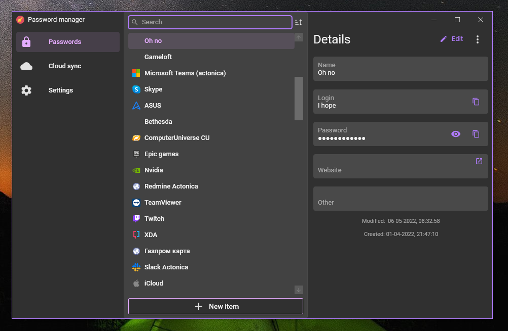
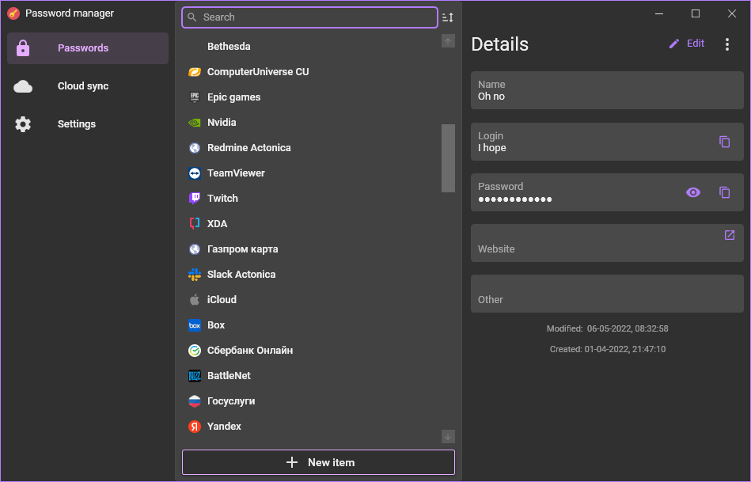

# SinglePass.WPF

This application allow to store login, passwords and other information that you need to authorize at any resource.

For easy using you can:
1. Specify Website field for password entry
2. Set hotkey in settings for popup
3. Go to Chromium-based browser (Google Chrome, MS Edge, etc.)
4. Navigate to website that you recently added
5. Press hotkey to open popup for authorization
6. Pick up login and password in fields

Material Design (MaterialDesignInXamlToolkit).

On Windows 10:

# Screenshots

